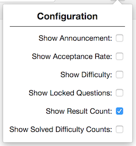
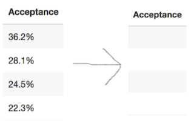
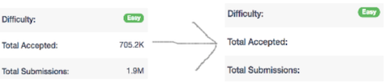
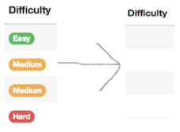
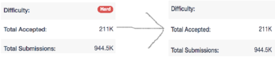
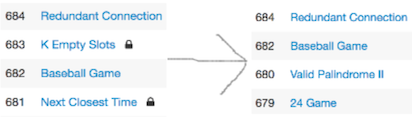
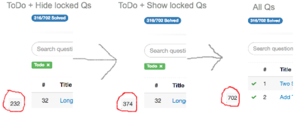
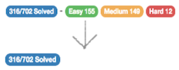

# LeetCode Customiser

This Chrome extension ([app store link](https://chrome.google.com/webstore/detail/leetcode-customiser/pcjpjebekdglngpoiamcilooibicjpmf)) enables for parts of the [LeetCode](https://leetcode.com) website to be customised. This includes the following settings:

## The Settings

### Show Announcement

This shows/hides the LeetCode announcement. The announcement can sometimes consume a lot of space on the website, which can be annoying.

### Show Acceptance Rate

This shows/hides the acceptance rate for all questions:

As well as for a single question:

### Show Difficulty

This shows/hides the difficulty for all questions:

As well as for a single question:

### Show Locked Questions

This shows/hides the locked questions:

### Show Result Count

This displays a result count that is fixed in the bottom-left of the screen. This is handy to see a question count when filters have been added. For example, displaying all Todo questions, with all locked questions hidden,

### Show Solved Difficulty Counts

This shows/hides the solved difficulty counts:

