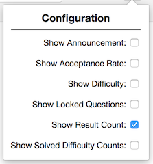

# LeetCode Customiser

This Chrome extension ([app store link](https://chrome.google.com/webstore/detail/leetcode-customiser/pcjpjebekdglngpoiamcilooibicjpmf)) enables for parts of the [LeetCode](https://leetcode.com) website to be customised. This includes the following settings:

## The Settings

Everything is hidden by default. Tick a setting in the extension's popup to show it again.

### Show Difficulty

This shows/hides question difficulties everywhere they appear: on a question's page (including its Similar Questions), the problem list, the problem list drawer on a question's page, and study plans.

### Show Acceptance Rate

This shows/hides the acceptance rate in the problem lists, as well as the Accepted/Acceptance Rate stats below a question.

### Show Locked Questions

This shows/hides the locked (premium) questions in the problem lists.

### Show Constraints

This shows/hides the Constraints section of a question's description.
